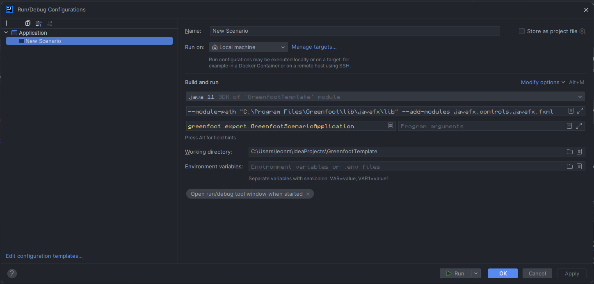
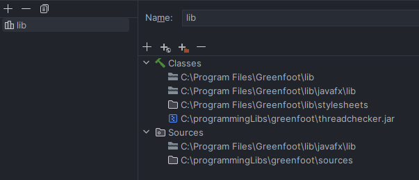

# Greenfoot IntelliJ IDEA Project

Dieses Projekt wurde mit [Greenfoot](https://www.greenfoot.org/) und [IntelliJ IDEA](https://www.jetbrains.com/idea/) erstellt. Es handelt sich um eine Simulation, die in Java geschrieben wurde.

## Setup

Um dieses Projekt auszuführen, müssen Sie in den Run/Debug Configurations die Main Klasse und VM-Optionen hinzufügen:

### Main Klasse
```
greenfoot.export.GreenfootScenarioApplication
```

### VM-Optionen
```shell
--module-path "C:\Program Files\Greenfoot\lib\javafx\lib" --add-modules javafx.controls,javafx.fxml
```



### Libraries

Außerdem müssen Sie die Bibliotheken von Greenfoot und JavaFX hinzufügen und die Library herunterladen:

https://github.com/Rc-Cookie/greenfoot-sources-combined/archive/refs/heads/main.zip



### SDK
```
C:\Program Files\Greenfoot\jdk
```

### Mit Greenfoot IDE öffnen
Wenn Sie das Projekt mit dem Richtigen Client von Greenfoot öffnen, können Sie die project.greenfoot -Datei öffnen und das Projekt wird automatisch geöffnet.
Dabei werden .class und .ctxt Dateien generiert welche mit der deleteCtxtAndClassFiles.bat gelöscht werden können, wenn der Path dort angepasst wurde.